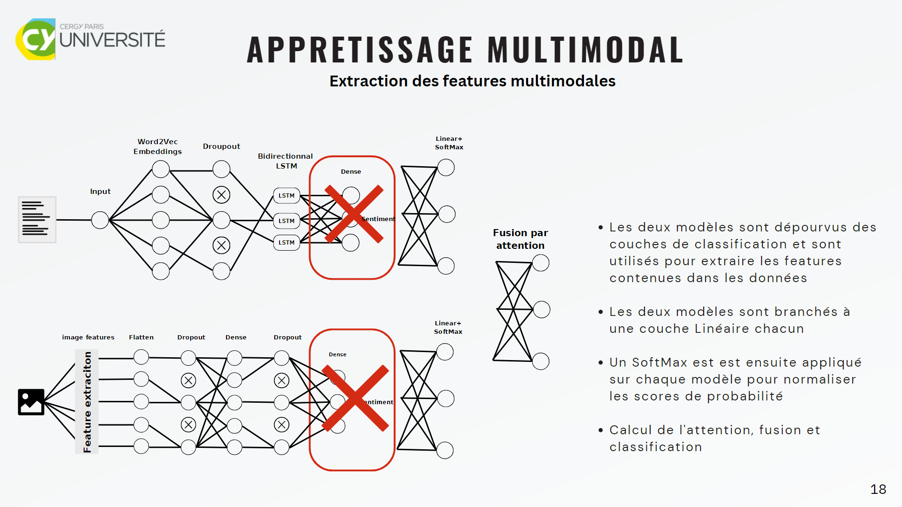
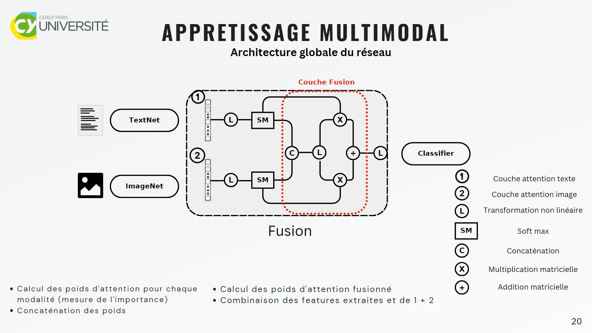
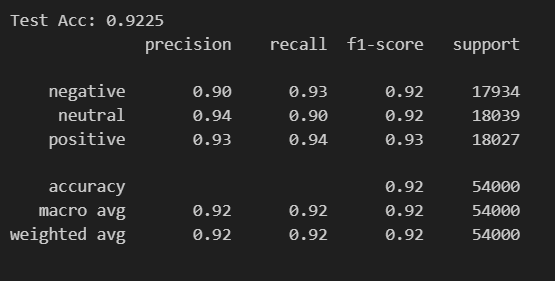
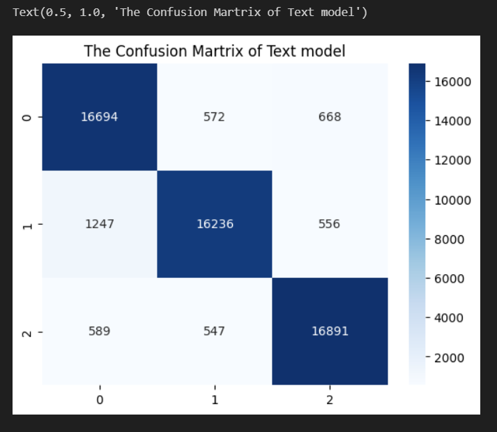

# Multimodal Sentiment Analysis

This project focuses on developing a machine learning model for sentiment analysis using multimodal data (text and images). This document provides an overview of the project, its goals, setup instructions, and additional details.

## Table of Contents

1. [Introduction](#introduction)
2. [Project Goals](#project-goals)
3. [Setup Instructions](#setup-instructions)
4. [Data](#data)
5. [Model Architecture](#model-architecture)
6. [Training](#training)
8. [Results](#results)
10. [License](#license)

## Introduction
Welcome to the Multimodal Sentiment Analysis Project! This project focuses on developing a machine learning model for sentiment analysis using multimodal data, such as text, images, and audio. The core of this project lies in attention fusion, where we combine attention mechanisms with fusion techniques to enhance sentiment analysis by leveraging multiple modalities.

Traditional sentiment analysis models often rely solely on text, overlooking valuable information from other modalities. By integrating multiple modalities through attention fusion, we aim to create a more comprehensive and accurate sentiment analysis system.

Attention fusion involves assigning different weights or importance to modalities based on their relevance to sentiment analysis. This allows the model to selectively attend to relevant features from each modality, effectively capturing and fusing multimodal information.

Our multimodal sentiment analysis model combines textual and visual modalities using attention fusion. By employing attention mechanisms within the model architecture, it learns to focus on the most informative aspects of each modality during sentiment analysis. This fusion of attention enhances the sentiment analysis performance and provides a deeper understanding of human emotions.

Throughout this project, we provide detailed instructions on implementing attention fusion in multimodal sentiment analysis, covering the setup process, model architecture, training, and evaluation. Our goal is to provide a robust and reusable codebase for researchers and practitioners interested in advancing sentiment analysis by harnessing the power of multimodal information through attention fusion.
## Project Goals

The primary goals of this project are:

- Develop a multimodal sentiment analysis model.
- Utilize attention fusion techniques for integrating information from different modalities.
- Train the model on diverse datasets to enhance its generalization capabilities.
- Evaluate and compare the model's performance with baseline approaches.
- Provide a reusable codebase for further research and development in multimodal sentiment analysis.

## Setup Instructions

To set up the project locally, please follow these steps:

1. Clone the repository: `git clone https://github.com/imadhou/sentiment-analysis`
2. Install the required dependencies:
    - Create conda environnement: 
    
    `conda create -y --name ps python=3.9`
    - Activate the environnement

    `conda activate ps`
    - Install environnement

    `conda env update -n ps -f environnement.yml`
    - Install project dependencies

    `pip install -r requirements.txt`
3. Run

   `python main.py`

## Data

In this Project we used the T4SA dataset (http://www.t4sa.it/) as the primary dataset for training and evaluation. The T4SA dataset is a widely recognized and publicly available dataset specifically designed for multimodal sentiment analysis tasks. It encompasses various modalities, including text, images, and audio, providing a rich and diverse set of data for training and testing the multimodal sentiment analysis model. By leveraging the T4SA dataset, the project aims to ensure the model's robustness and effectiveness across different modalities and domains of sentiment analysis.

## Model Architecture
The Multimodal Sentiment Analysis model architecture consists of the following components:

- Image Model: Extracts features from image inputs.
- Text Model: Processes text inputs and generates corresponding features.
- Attention Mechanisms: Compute attention weights for both image and text features.
- Fusion Layer: Combines the image and text features into a fused representation.
- Nonlinear Layer: Enhances the fused features using nonlinearity.
- Classification Layer: Maps the fused features to the number of output classes.

During the forward pass, the model leverages attention fusion techniques to selectively attend to relevant features from both modalities. The fusion of the attended features enhances the model's ability to capture multimodal information and make accurate sentiment predictions.

By combining textual and visual cues through attention fusion, our model achieves a more comprehensive understanding of sentiment, surpassing the limitations of traditional text-based sentiment analysis approaches.

For a detailed implementation of the model architecture, including layer configurations and attention mechanisms, refer to the code in the provided MultimodalModel class.

## Training

Certainly! Here are the key facts about training the multimodal sentiment analysis model, based on the provided code:

- **Data Loading and Splitting**: The dataset is loaded, and it is split into training and testing subsets using `train_test_split` from scikit-learn. The test size is set to 20%, and a random state of 42 is used.

- **Data Loading for Training and Testing**: Data loaders are created for the training and testing subsets. The training data is loaded with a batch size of 258, enabling shuffling, and pinning memory for efficient training. The same settings are applied to the test data loader.

- **Model Initialization**: The model architecture consists of a text model and an image model. The text model is initialized with the specified number of classes (3), and the image model is initialized with the provided image shape. These models are then combined into an instance of the `MultimodalModel`.

- **Loss Function and Optimizer Initialization**: The loss criterion is set to the cross-entropy loss. The optimizer used is Adam, with a learning rate of 0.001, optimizing the parameters of the model.

- **Model Training**: The training process is initiated using the `train` function from the `utils` module. The model is trained for 20 epochs, using the `Adam` optimizer `torch.optim.Adam()`, `CrossEntropyLoss` criterion `nn.CrossEntropyLoss()`, and device (CUDA if available, otherwise CPU). Training progress is printed during the process.

## Results

